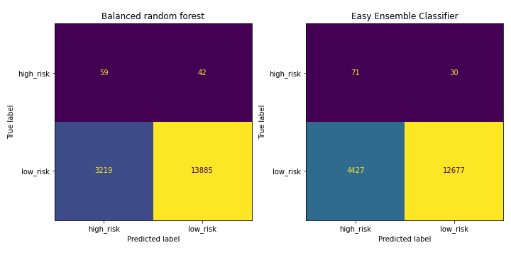

# machine-learning
## Credit Risk Resampling Techniques and Ensemble learning


## Background

To build and evaluate various ML models for credit risk anqalysis.

1. [Resampling](#Resampling)
2. [Ensemble Learning](#Ensemble-Learning)

## Installation Requirements

* Use the `conda install` command to download the `imbalanced-learn` module.

```shell
    * conda install -c conda-forge imbalanced-learn
    * conda install python-graphviz
    * conda install graphviz
    * conda install -c conda-forge pydotplus
```
## Notebooks

[Resampling Starter Notebook](./credit_risk_resampling.ipynb)

[Ensemble Starter Notebook](./credit_risk_ensemble.ipynb)

## Results

### Ensemble Learning:


### Resampling Techniques:

1. Which model had the best balanced accuracy score?

   Simple Logistic Regression

2. Which model had the best recall score?

    Simple Logistic Regression has a score of 0.98

3. Which model had the best geometric mean score?

    Simple Logistic Regression has a score of 0.99
